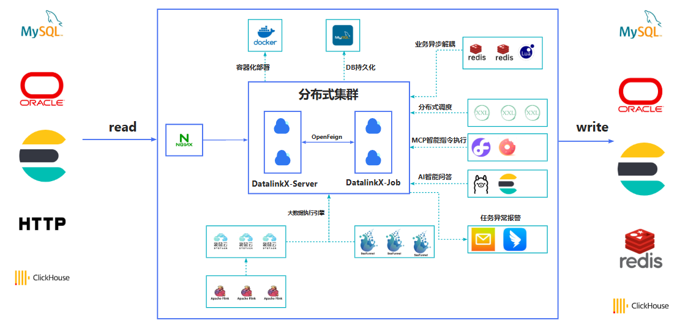
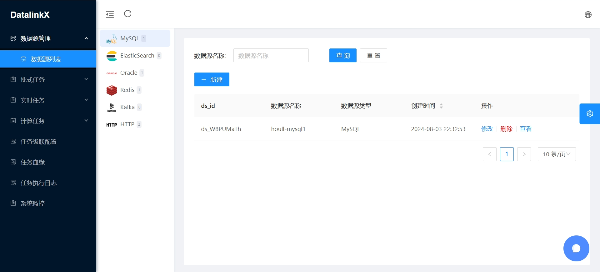
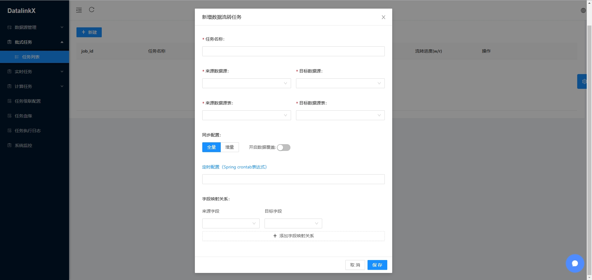

<a href="https://gitee.com/atuptown/datalinkx"></a>
  <a href="https://gitee.com/atuptown/datalinkx"></a>
<a href="#"></a>
<a href="#项目文档"></a>
  <a href="#项目文档"></a>
  <a href="#项目文档"></a>
  <a href="#项目文档"></a>
  <a href="#项目文档"></a>
  <a href="#项目文档"></a>
  <a href="#项目文档"></a>
  <a href="#项目文档"></a>
  <a href="#项目文档"></a>
  <a href="#项目文档"></a>
  <a href="#项目文档"></a>
<a href="#项目文档"></a>
<a href="#项目文档"></a>

## 异构数据源同步服务DatalinkX介绍

 **核心功能** ：在不同的异构数据源中进行数据同步，对同步任务进行管理和维护

 **意义**：只要公司规模较大，部门与部门之间有数据协作都应该有类似DatalinkX的项目，比如爬虫组的同事爬下来数据要定时同步到数仓组负责的库下。同步服务会集中管理同步任务，收拢同步日志、提高内部工作效率。



## 项目特性

- **简单易用**：通过Web页面快速创建数据源、同步任务，操作简单，一分钟上手
- **定时触发**：对接xxl-job定时，设置cron表达式触发同步任务
- **配置化任务对接**：将数据库信息、任务详情界面化配置
- **高性能同步**：使用高性能流式flink计算引擎   
- **容器化部署**：支持docker部署

## 项目技术栈
| 依赖					            | 版本					         |描述
|--------------------|-----------------|-------
| Spring Boot			     | 2.4.3					      |项目脚手架
| SpringData JPA			  | 2.4.3					      |持久层框架
| MySQL					         | 8.0					        |DB数据库
| Redis					         | 5.0 ↑					      |缓存数据库
| ChunJun(原FlinkX)		 | 1.10_release			 |袋鼠云开源数据同步框架
| Flink					         | 1.10.3					     |分布式大数据计算引擎
| Xxl-job				        | 2.3.0					      |分布式调度框架
| Retrofit2				      | 2.9.0					      |RPC通信服务
| Jackson				        | 2.11.4					     |反序列化框架
| Maven					         | 3.6.X					      |Java包管理
| Vue.js					        | 2.X					        |前端框架
| AntDesignUI			     | 3.0.4					      |前端UI
| Docker					        | 					           |容器化部署

## 启动姿势

#### 中间件
执行 `docker compose -p datalinkx up -d` 命令将各组件启动

##### 手动搭建组件（linux）：
xxl-job: https://github.com/xuxueli/xxl-job/archive/refs/tags/2.3.0.zip
纯Java项目，可clone代码后打包成jar包启动，xxl-job依赖mysql，需要修改对应数据库地址配置，表结构在/xxl-job-2.3.0/doc/db/tables_xxl_job.sql，导入mysql即可。


flink：https://archive.apache.org/dist/flink/flink-1.10.3/
选择flink-1.10.3-bin-scala_2.12.tgz下载，解压进入bin目录执行./start-cluster.sh，首次运行默认只有一个任务slot，访问http://localhost:8081 进去flink后台页面。

#### DB层
执行  /datalinkx-server/src/main/resources/db.sql

#### 后端
1. 运行`datalinkx-server`与`datalinkx-job`模块
   1. **datalinkx-server**与front交互，依赖mysql、redis
   2. **datalinkx-job**负责提交、维护任务的生命周期，依赖xxl-job、flink 
      1. 服务启动后会默认使用netty启动`${xxl.job.executor.port}` 负责监听xxl-job的任务事件 
      2. 任务执行详细信息通过datalinkx-client的rpc能力访问`${client.dataserver}`
      3. 如果更改了datalinkx-server端口需要同步更改datalinkx-job配置项`${client.dataserver}`。
      4. `${flinkx.path}`配置flinkx模块的路径
   3. 遇到依赖问题执行 ```mvn clean -U ```
2. flinkx模块为单独的项目 
   1. 需要手动执行`mvn clean install -U -Dmaven.test.skip=true -Dcheckstyle.skip=true`将插件打包 
   2. 打包后配置好flinkx/flinkconf中flink的地址`jobmanager.rpc.address:`和端口`rest.port`即可

#### 前端
`yarn install && export NODE_OPTIONS=--openssl-legacy-provider && yarn run serve`


## 使用姿势
作者是一名纯粹的JavaBoy，前端代码只停留在大学水平，献丑了

1. 登录系统，默认密码admin、admin登录，没有权限相关控制


2. 数据源管理，配置数据流转数据源信息


3. 任务管理，配置from_db与to_db构造job_graph


4. 任务调度

5. 任务执行


## 联系作者
私聊进群我会拉到项目交流群中

